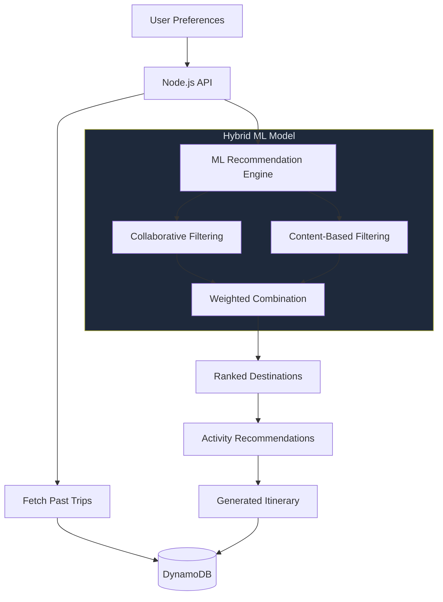

# Travel Itinerary

Personalized travel recommendation system combining a hybrid ML model (collaborative + content-based filtering) with a Node.js REST API backed by AWS DynamoDB.



## Features

- **Hybrid recommendation model** -- Combines matrix factorization (collaborative filtering) with a neural network (content-based filtering) for destination ranking
- **User preference encoding** -- One-hot encoding for categorical features (vibes, activities) and StandardScaler normalization for numerical features (budget)
- **REST API** -- Express.js server with endpoints for itinerary generation and trip history retrieval
- **AWS integration** -- DynamoDB for persistent user trip storage with automatic UUID generation
- **Travel mate support** -- Accepts companion preferences to generate group-compatible itineraries

## API Endpoints

| Method | Endpoint | Description |
|--------|----------|-------------|
| `POST` | `/api/itinerary` | Generate itinerary from user + travel mate preferences |
| `GET` | `/api/user/:userId/trips` | Retrieve past trips for a user |

### Example Request

```bash
curl -X POST http://localhost:3000/api/itinerary \
  -H "Content-Type: application/json" \
  -d '{
    "userId": "user123",
    "preferences": {"budget": 5000, "vibes": ["cultural"], "activities": ["hiking"]},
    "travelMatePreferences": {"budget": 3000, "vibes": ["adventure"]}
  }'
```

## Project Structure

```
Travel-Itinerary/
├── nodejs-travel-api.js                              # Express API server
├── travelv2.ipynb                                    # ML model training notebook
├── travel_data_with_complex_relations_and_reviews.csv # Training dataset
└── README.md
```

## Tech Stack

| Layer | Technology |
|-------|-----------|
| API | Express.js, Node.js |
| Database | AWS DynamoDB |
| ML | scikit-learn, PyTorch (collaborative + content-based filtering) |
| Data | pandas, NumPy |
| Notebook | Jupyter |

## License

MIT
